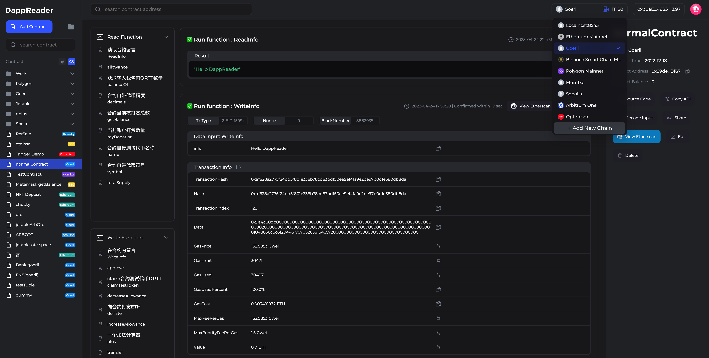
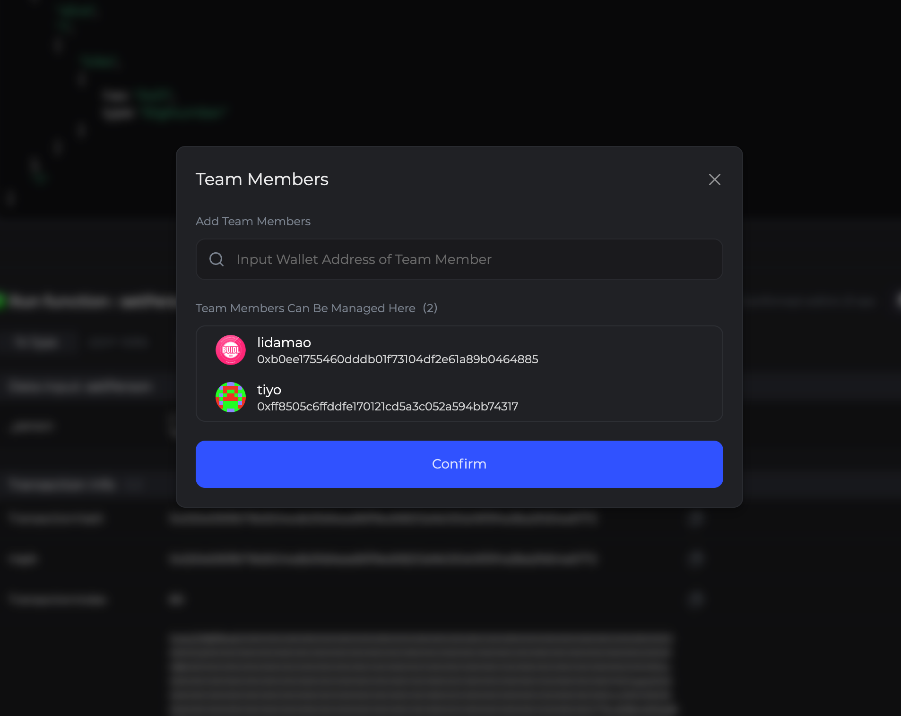
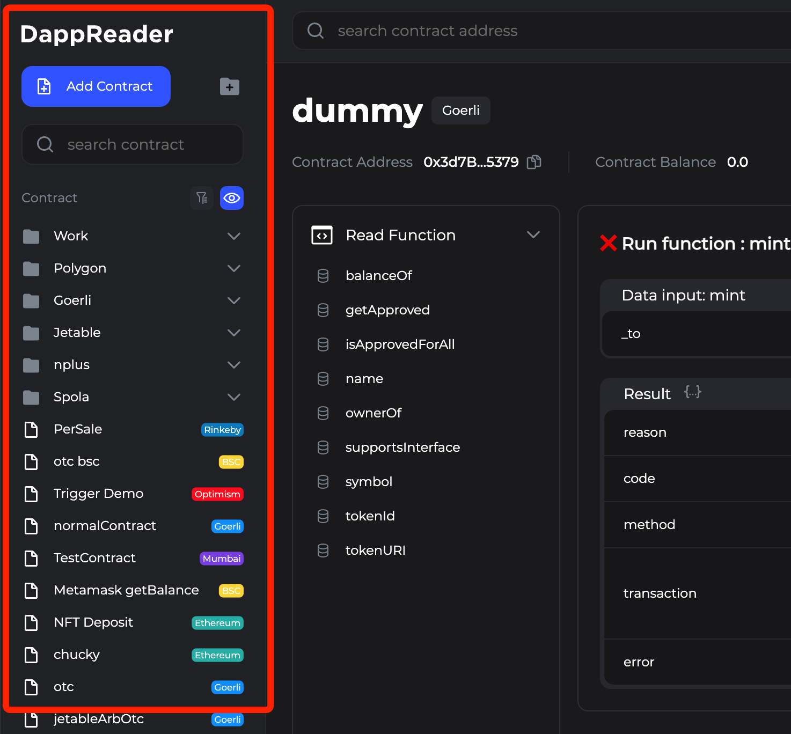

# DappReader




### **DappReader是一款令我们自豪的产品,一款全面面向EVM生态开发者服务的免费工具**

DappReader旨在为开发者提供已发布的多链合约的管理和快速前端-合约调试。这款工具将帮助开发者更加高效地开发、测试和部署合约项目，提升项目的开发质量和效率。

> 你可以简单理解为对标web2时代的的 **Postman** !

### 你是否也有相同烦恼:

1. 使用Remix和Etherscan.io等工具处理已有合约或调试新合约非常不友好，并且需要频繁地更新和验证代码。
2. 写过的合约很久后忘记在哪里,需要翻交互记录才能找到

3. 与团队成员或其他前端工程师进行远程协作时也很繁琐。

4. 另外，让非开发人员使用智能合约需要写复杂的UI并部署到中心化服务器上。

### DappReader的主要功能:
1. 多种方式方便添加与管理所有EVM链智能合约
2. 快速检索与管理已发布的合约
3. 无代码快速生成智能合约操作界面
4. 对智能合约整体以及每一个函数单独进行注释
5. 与开发者或非开发者快速分享开发中的智能合约(包含注释),方便合约工程师与前端工程师联调
6. 提供完全免费的团队分享功能,非常适合小团队使用
7. 提供一系列类型转换工具,减少开发者工作量


### DappReader当前的开发进度:

- [x] UI完全重新设计开发,使用而更加方便舒适
- [x] 重新设计返回的展示方案
- [x] 重新设计且开发动态侧边栏,让开发者更专注于合约本身
- [x] 开发完整的团队分享功能
- [ ] 加入更多AI功能
- [ ] 基于多个智能合约流程执行功能
- [ ] 基于外部变化自动执行合约的Trigger功能
- [ ] 用户无代码生成简单前端页面并分享功能
- [ ] 集成Remix完成一站式开发测试分享功能
- [ ] 深度结合web2与web3,完成**web3os**

### DappReader功能介绍:


快速与团队成员分享智能合约



快速管理个人与公司的多个链上智能合约

### 加入我们的中文社区


### Do you have the same frustrations as well:

1. It is very unfriendly to use tools like Remix and Etherscan.io to handle existing contracts or debug new contracts, and the code needs to be updated and verified frequently.
2. After a long time, you forget where you wrote the contract and need to search through communication records to find it.
3. It is also cumbersome to collaborate with team members or other front-end engineers remotely.
4. Additionally, making non-developers use smart contracts requires writing complex UI and deploying them to centralized servers.

### Main Features of DappReader:

1. Conveniently add and manage all EVM chain smart contracts in various ways.
2. Quickly search and manage published contracts.
3. Quickly generate smart contract operation interfaces without code.
4. Add comments to the entire smart contract or each individual function.
5. Quickly share developing smart contracts (with comments) with developers or non-developers, making it easy for contract engineers to collaborate with front-end engineers.
6. Provides completely free team-sharing function that is ideal for small teams.
7. Provides a series of type conversion tools to reduce the workload for developers.

DappReader Development Progress:

- [x] Completely redesigned UI for a more convenient and comfortable experience.
- [x] Redesigned the display of returned data.
- [x] Developed a dynamic sidebar to allow developers to focus more on the contract itself.
- [x] Developed a complete team sharing feature.
- [ ] Adding more AI functionality.
- [ ] Functionality for executing multiple smart contract processes.
- [ ] Trigger functionality for automatically executing contracts based on external changes.
- [ ] Functionality for users to generate simple front-end pages without code and share them.
- [ ] Integration with Remix to provide one-stop development, testing, and sharing features.
- [ ] Deep integration of web2 and web3 to complete web3os.


## 快速安装

下载本项目到本地后

```
yarn install
```

### 在本地运行
```
yarn run serve
```

### 编译本项目
```
yarn run build
```